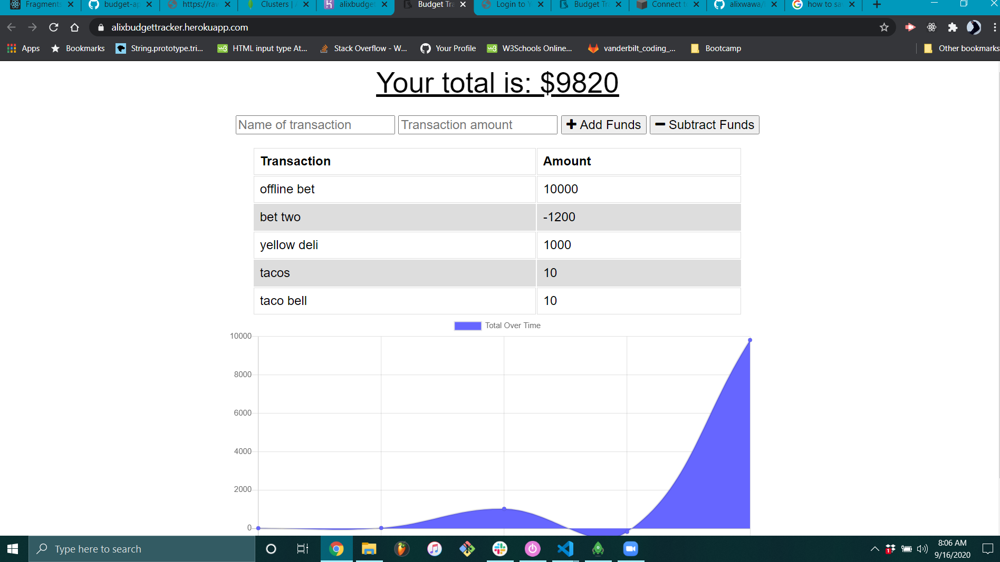

# Unit 18 PWA Homework: Online/Offline Budget Trackers

## Description 

The user will be able to add expenses and deposits to their budget with or without a connection. When entering transactions offline, they should populate the total when brought back online.

Offline Functionality:

Enter deposits offline

Enter expenses offline

When brought back online:

Offline entries should be added to tracker.

## User Story

As someone who can't manage their expenses very well I'd like to be able to track my expenses anywhere I go, regardless of the presence of internet connectivity.

### App screenshot

   

## Repository

- [Project Repo](https://github.com/alixwawa/budgettracker)
- [Budget App](https://alixbudgettracker.herokuapp.com)

## GitHub

- [GitHub Profile](https://github.com/alixwawa)
